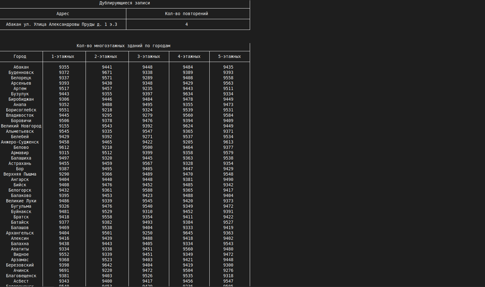

Описание задания
У нас есть 2 файла-справочника городов (файлы во вложении). Один файл в формате xml, другой в формате csv.
Необходимо разработать консольное приложение. После запуска приложение ожидает ввода пути до файла-справочника либо команды на завершение работы (какая-то комбинация клавиш).По команде завершения работы приложение завершает свою работу. После ввода пути до файла-справочника приложение формирует сводную статистику:
1) Отображает дублирующиеся записи с количеством повторений.
2) Отображает, сколько в каждом городе: 1, 2, 3, 4 и 5 этажных зданий.
После вывода статистики приложение снова ожидает ввода пути до файла-справочника либо команды на завершение работы.
В процессе работы приложение падать не должно, выход только по команде на завершение работы.

# Запуск

## С ромощью gradle wrapper
./gradlew run 

## Запуск jar файла
java -jar test-task-java.jar  (jar файл можно скачать в релизах)

Вводить необходимо абсолютный путь до файла

Результат выполнения: 

